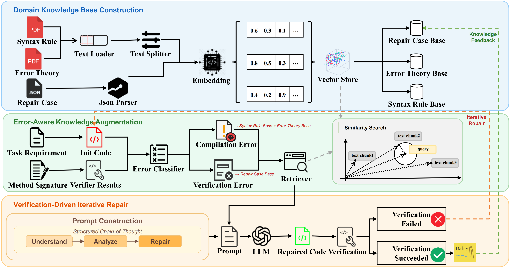
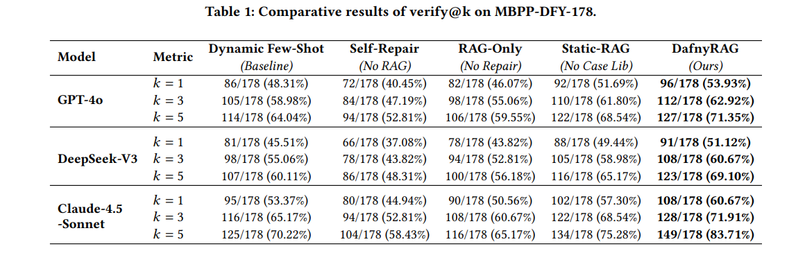

# DafnyRAG

**Automated Repair of Dafny Code via Retrieval-Augmented Generation and Iterative Verification**

> A system that iteratively repairs Dafny code by leveraging formal verification feedback and retrieval-augmented generation to improve formal specification accuracy.

---

## Overview

DafnyRAG is a novel framework that enhances LLM-based formal code generation through retrieval-augmented generation (RAG). It addresses the challenge of automatically generating and repairing formal specifications (loop invariants, pre/postconditions) in Dafny — a verification-aware programming language built on the Z3 SMT solver.

### Key Idea

Unlike standard generation methods, DafnyRAG employs a two-fold strategy:

1. **Heterogeneous Domain Knowledge Base** — A specialized knowledge base comprising static syntax rules, error theories, and dynamic repair cases to bridge the domain knowledge gap of general-purpose LLMs.
2. **Verification-Driven Iterative Repair Loop** — An error-aware retrieval routing mechanism coupled with a structured Chain-of-Thought protocol that not only fixes errors but also feeds successful repairs back into the knowledge base for continuous self-improvement.

### Framework



## Results

Evaluated on the **MBPP-DFY-178** benchmark across three representative LLMs:



*verify@5 metric — percentage of programs successfully verified within 5 attempts.*

## Getting Started

### Prerequisites

- **Python** 3.8+
- **Dafny** 4.11.0
- **Ubuntu** 20.04 (recommended)
- API keys for at least one of: OpenAI (GPT-4o), Anthropic (Claude-4.5-Sonnet), or DeepSeek (DeepSeek-V3)

### Installation

```bash
# Clone the repository
git clone https://github.com/netshells1/DafnyRAG.git
cd DafnyRAG

# Install Python dependencies
pip install -r requirements.txt

# Install Dafny 4.11.0
# See https://github.com/dafny-lang/dafny/releases/tag/v4.11.0
```

### Configuration

Set your LLM API key as an environment variable:

```bash
export OPENAI_API_KEY="your-key-here"
# or
export ANTHROPIC_API_KEY="your-key-here"
# or
export DEEPSEEK_API_KEY="your-key-here"
```

### Usage

```bash
# Run DafnyRAG on the MBPP-DFY-178 benchmark
python main.py --model gpt-4o --max_iterations 5 --temperature 0.5

# Run with a specific task
python main.py --model gpt-4o --task_id 1 --max_iterations 5
```
