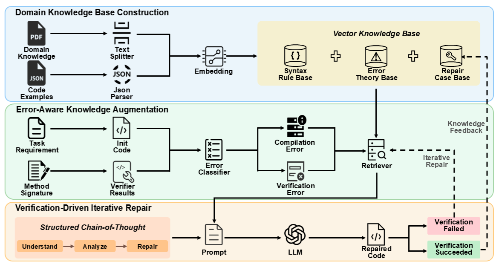
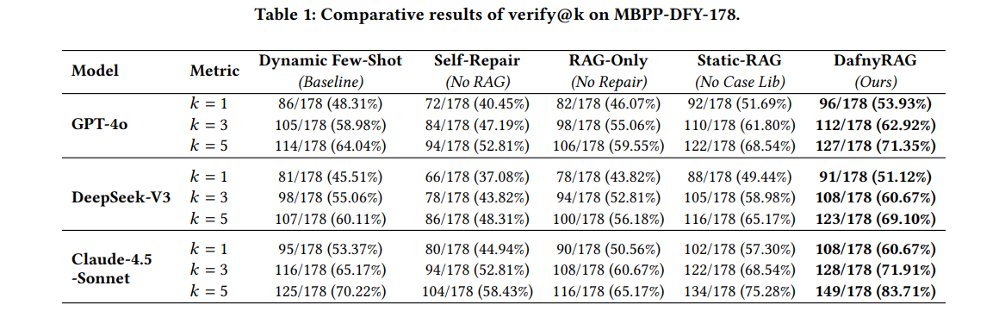

# DafnyRAG

**Automated Repair of Dafny Code via Retrieval-Augmented Generation and Iterative Verification**

> A system that iteratively repairs Dafny code by leveraging formal verification feedback and retrieval-augmented generation to improve formal specification accuracy.

---

## Overview

DafnyRAG is a novel framework that enhances LLM-based formal code generation through retrieval-augmented generation (RAG). It addresses the challenge of automatically generating and repairing formal specifications (loop invariants, pre/postconditions) in Dafny, a verification-aware programming language built on the Z3 SMT solver.

### Key Idea

Unlike standard generation methods, DafnyRAG employs a two-fold strategy:

1. **Heterogeneous Domain Knowledge Base** - A specialized knowledge base comprising static syntax rules, error theories, and dynamic repair cases to bridge the domain knowledge gap of general-purpose LLMs.
2. **Verification-Driven Iterative Repair Loop** - An error-aware retrieval routing mechanism coupled with a structured Chain-of-Thought protocol that not only fixes errors but also feeds successful repairs back into the knowledge base for continuous self-improvement.

### Framework



## Results

Evaluated on the **MBPP-DFY-178** benchmark across three representative LLMs:



*verify@5 metric - percentage of programs successfully verified within 5 attempts.*

## Getting Started

### Prerequisites

- **Python** 3.10+
- **Dafny** 4.11.0 or later
- **Operating System**: Ubuntu 20.04+ or Windows 10/11
- API keys for at least one of: OpenAI (GPT-4o), Anthropic (Claude-4.5-Sonnet), or DeepSeek (DeepSeek-V3)

### Installation

```bash
# Clone the repository
git clone https://github.com/netshells1/DafnyRAG.git
cd DafnyRAG

# Install Python dependencies
pip install -r requirements.txt

# Register the local CLI package so `python -m dafnyrag.repair` works
pip install -e .

# Install Dafny 4.11.0
See https://github.com/dafny-lang/dafny/releases/tag/v4.11.0
```

### Configuration

Set your LLM API key as an environment variable. The DB builders use `OPENAI_API_KEY` for embeddings:

```bash
export OPENAI_API_KEY="your-key-here"
# or
export ANTHROPIC_API_KEY="your-key-here"
# or
export DEEPSEEK_API_KEY="your-key-here"
```

If you use an OpenAI-compatible endpoint for the DB builders, also set:

```bash
export OPENAI_BASE_URL="https://your-openai-compatible-endpoint/v1"
```

If you use the official OpenAI endpoint, `OPENAI_BASE_URL` can be omitted.

### Build Vector Databases

The scripts in `DB/` no longer contain hardcoded API keys or local absolute paths. By default, they read input files from `source/` and write Chroma databases to the repository root.

```bash
# Build the repair-case database from source/*.json
python DB/json_db_builder.py

# Build the Dafny error reference database from source/Dafny_Error.pdf
python DB/error_db_builder.py

# Build the Dafny grammar reference database from source/Dafny_Grammar.pdf
python DB/grammar_db_builder.py
```

You can override the default input paths if needed:

```bash
python DB/json_db_builder.py --json-directory source
python DB/error_db_builder.py --pdf-file source/Dafny_Error.pdf
python DB/grammar_db_builder.py --pdf-file source/Dafny_Grammar.pdf
```

### Usage

```bash
# Repair a single Dafny file
python -m dafnyrag.repair --input path/to/buggy.dfy --llm GPT-4 --max-iters 5 --out-dir repairs

# Repair all .dfy files in a directory
python -m dafnyrag.repair --input path/to/benchmark_dir --llm GPT-4 --max-iters 5 --kb-dir . --out-dir repairs
```
